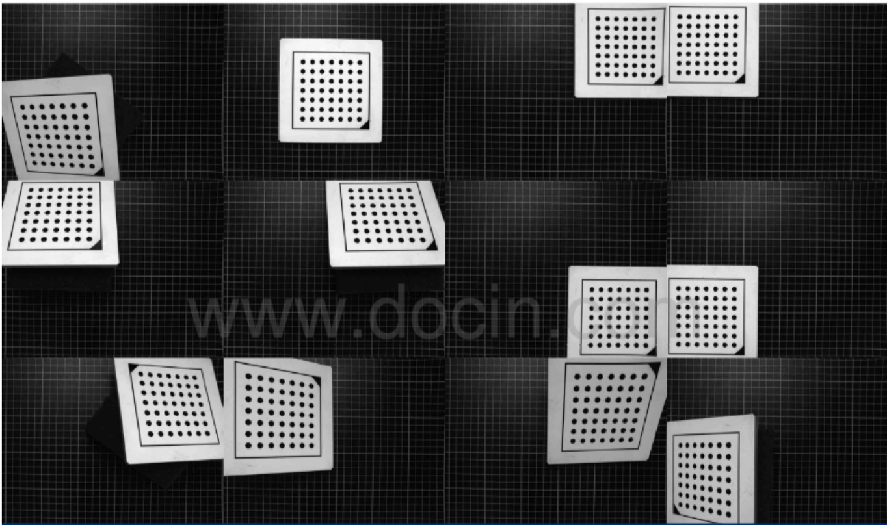

# Calibration-and-Measurement

## Calibtraion.py is for camera calibration using OpenCV Chessboard calibration plate.

- Input Parameters:
    1. length: length of the square (a single chess lattice) in mm
    2. rows: the number of lattices in a column (number of rows)
    3. cols: the number of lattices in a row (number of columns)
    4. image_path: path of images of calibration plate images, i.e. "./images/"
- Return Parameters:
    1. Bool Value
    2. Camera Intrinsic Matrix
    3. Distortion Matrix
- Other Output:
    - Generate a directory "./calibration_results" containing numpy arrays of all the calibration
    result matrixes. The number of rotation_matrix_*.txt and translation_matrix_*.txt represents
    the corresponding number of input images.

Please note that:
    1. Some parameters may need modifications for real condition.
    2. Calibration is a ONE-TIME process. Manually check of calibration images is NECESSARY.

## Undistort.py is to undistort an imange after calibration. Camera intrinsic matrixand undistortion matrix are mandatory.

- Input Parameters:
    1. image: input image 
    2. camera_mat_path: the matrix intrinsic matrix txt file obtained from calibration 
    function. i.e. "./calibration_result/camera_intrinsic_matrix.txt"
    1. distrot_mat_path: the distortion matrix txt file obtained from calibration 
    function. i.e. "./calibration_result/distortion_matrix.txt"
- Output:
    - undistorted image
- Return Parameters:
    - undistorted image

## Transform.py is to find out mm-pixel ratio using **OpenCV Chessboard calibration plate**.

- Input Parameters:
    1. length: length of the square (a single chess lattice) in mm
    2. rows: the number of lattices in a column (number of rows)
    3. cols: the number of lattices in a row (number of columns)
    4. img: input image of the calibration plate
- Return Parameters:
    1. averaging mm per pixel
    2. deviation of mm/pixel
   
Please note that :
- Some parameters may need modifications for real condition.
- For more accurate result, the camera plane should be as parallel to object plane as possible.

An example for using thess subroutines is **test.py**, where 10 images of OpenCV Chessboard calibration plates are used for calibration and pixel_mm transformation. However, these 10 images are **NOT** quilified
to perform an effective calibration, as they do not have different orientations. Effective photo set should be like this:

I only find Halcon calibration photo set here. However, you should use OpenCV chessboard calibration plate.